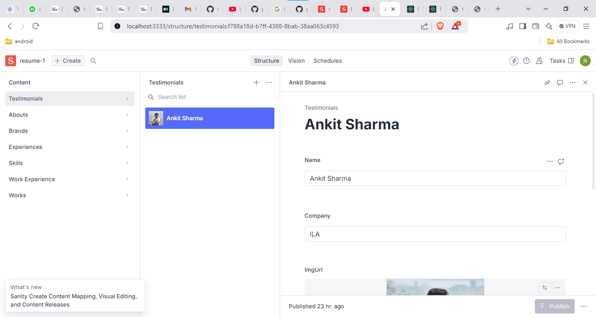

## - working with backend -------------------
1) npm create sanity@latest -- --project pysl7zne --dataset production --template clean --typescript --output-path studio-resume-1
cd studio-resume-1

2) to update the sanity from .ts to .js 
npm uninstall typescript @types/node @types/react
3) all the above are for typescript so

## -  to download the santy with javascript --
1) npm create sanity@latest -- --project pysl7zne --dataset production --template clean --output-path studio-resume-1

2) 

3) to create a documnet in that testimolial file we have to follow belows
    1) 
    2) 
    3) 
4) 
5) ## ------------ creating front-app ----------------------------
6) install all the dependecny 
=> npm install @sanity/client @sanity/image-url framer-motion node-sass 
7) here the node-sass required python installed in your system if python didn't installed in your systm then it will throw the error so after install the python install the node-sass.
7) commands are => npm install @sanity/client @sanity/image-url framer-motion
8) npm install sass
9) 
=> npm install @sanity/client @sanity/image-url @testing-library/jest-dom @testing-library/react @testing-library/user-event framer-motion node-sass react react-dom react-icons react-scripts react-tooltip web-vitals

## ----------------- to give the class name of a particualr container or element based on there parent name we are using the CSS BEM Methodology
exa=> app__navbar here __ is a BEM methologies

10) to set the icon of three dot for small device we need to download the   react-icon for that
11) npm install react-icons
12) we have use the framer-motion for motion  link=> https://motion.dev/
13) navbar complated 
14) 

## ----------------------- 
15) header section completed 
16) 
## -----------------------------
17) complete the about section without sanity
18) 

## ----------- now we are going to connect our react application to sanity

19) to connect the sanity with react app we need some parameters like=> pojectId, dataset,apiVesion,useCdn, token. which we can take from the sanity's that peoject.
20) 
21) 
22) to get the token we have to follow 
23) 
24) add the localhost:3000 in this 
25) 
26) 
27) click on Add Api token and select the edit check boox
28) 
29) 
30) after appyed the sanity 
31) 
32) 
33) completed the work section
34) 
35) 
36) 
37) install the npm install react-tooltip
38) The `react-tooltip` library is used in React applications to display tooltips—small, contextual messages that appear when users hover over, focus on, or click an element. Tooltips are commonly used to provide additional information about a UI element without cluttering the interface.

---

### **Key Features of `react-tooltip`:**
1. **Customizable Tooltips:**
   - You can style the tooltips to match your application's theme.
2. **Event-based Triggering:**
   - Tooltips can be shown on hover, focus, or click events.
3. **Dynamic Content:**
   - The content of the tooltip can be dynamic and even include HTML or React components.
4. **Placement Control:**
   - You can control where the tooltip appears (e.g., top, bottom, left, right).
5. **Lightweight and Easy to Use:**
   - Minimal configuration is needed to get started.

---

### **How to Use `react-tooltip`:**

#### **1. Install the Library**
   ```bash
   npm install react-tooltip
   ```

#### **2. Import and Setup**
   ```jsx
   import React from 'react';
   import ReactTooltip from 'react-tooltip';

   const Example = () => {
     return (
       <div>
         <button data-tip="This is a tooltip!">Hover over me</button>
         <ReactTooltip />
       </div>
     );
   };

   export default Example;
   ```

#### **3. Advanced Usage**
   You can customize the tooltip using props or inline styles.

   ```jsx
   import React from 'react';
   import ReactTooltip from 'react-tooltip';

   const AdvancedExample = () => {
     return (
       <div>
         <button data-tip="I am a custom tooltip!" data-place="right" data-effect="solid">
           Hover over me
         </button>
         <ReactTooltip
           place="top"
           type="dark"
           effect="float"
           delayShow={500} // Delay in milliseconds
         />
       </div>
     );
   };

   export default AdvancedExample;
   ```

#### **4. Dynamic Content**
   You can pass dynamic data to tooltips.

   ```jsx
   import React from 'react';
   import ReactTooltip from 'react-tooltip';

   const DynamicTooltip = ({ info }) => {
     return (
       <div>
         <button data-tip={info}>Hover to see info</button>
         <ReactTooltip />
       </div>
     );
   };

   export default DynamicTooltip;
   ```

---

### **Common Use Cases for `react-tooltip`:**
1. **Icon Descriptions:**
   - Provide additional information about icons or buttons.
   ```jsx
   <i data-tip="Settings" className="fa fa-cog"></i>
   <ReactTooltip />
   ```

2. **Forms:**
   - Add contextual help for form fields.
   ```jsx
   <input data-tip="Enter your full name" placeholder="Full Name" />
   <ReactTooltip />
   ```

3. **Charts and Visualizations:**
   - Display data values or details when hovering over chart points.

4. **Feature Highlights:**
   - Explain new features in an application.

---

### **Why Use `react-tooltip`?**
- It simplifies the process of creating tooltips, eliminating the need for custom tooltip implementations.
- Provides built-in accessibility (e.g., for screen readers).
- Saves development time with ready-to-use configurations and extensive customization options.


## - getting error as ERROR in ./src/container/Skills/Skills.jsx 130:45-57
export 'default' (imported as 'ReactTooltip') was not found in 'react-tooltip' (possible exports: Tooltip, TooltipProvider, TooltipWrapper, removeStyle)
20) ans - to fix it
## --- this is now version  react-tooltip@5.28.0
21) to check  npm list react-tooltip

## ------------------------
22) 
23) 
24) 
25) output-- 
26) ## --------------- this is for teestimonial section 
27) 
28) 
29) 
30) 
31) 

## ------------------- footer section ----------
32) 
32) this below data is comming from the react app after submit
33) 

## ----------- now to deplay our application we can use any one platform but to get the data we neet to give that url where url front is running in sanity api managemnt 
