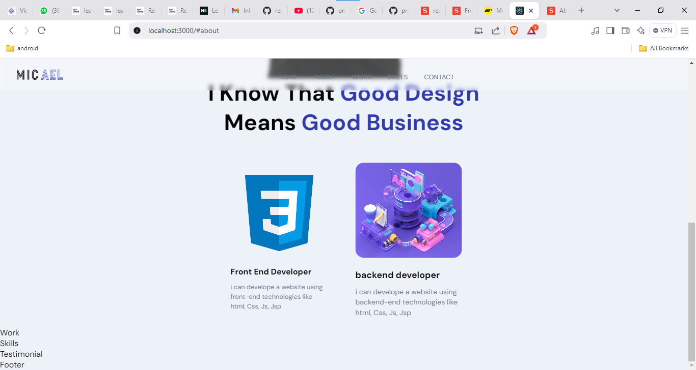

## - working with backend -------------------
1) npm create sanity@latest -- --project pysl7zne --dataset production --template clean --typescript --output-path studio-resume-1
cd studio-resume-1

2) to update the sanity from .ts to .js 
npm uninstall typescript @types/node @types/react
3) all the above are for typescript so

## -  to download the santy with javascript --
1) npm create sanity@latest -- --project pysl7zne --dataset production --template clean --output-path studio-resume-1

2) 

3) to create a documnet in that testimolial file we have to follow belows
    1) 
    2) 
    3) 
4) 
5) ## ------------ creating front-app ----------------------------
6) install all the dependecny 
=> npm install @sanity/client @sanity/image-url framer-motion node-sass 
7) here the node-sass required python installed in your system if python didn't installed in your systm then it will throw the error so after install the python install the node-sass.
7) commands are => npm install @sanity/client @sanity/image-url framer-motion
8) npm install sass
9) 
=> npm install @sanity/client @sanity/image-url @testing-library/jest-dom @testing-library/react @testing-library/user-event framer-motion node-sass react react-dom react-icons react-scripts react-tooltip web-vitals

## ----------------- to give the class name of a particualr container or element based on there parent name we are using the CSS BEM Methodology
exa=> app__navbar here __ is a BEM methologies

10) to set the icon of three dot for small device we need to download the   react-icon for that
11) npm install react-icons
12) we have use the framer-motion for motion  link=> https://motion.dev/
13) navbar complated 
14) 

## ----------------------- 
15) header section completed 
16) 
## -----------------------------
17) complete the about section without sanity
18) 

## ----------- now we are going to connect our react application to sanity

19) to connect the sanity with react app we need some parameters like=> pojectId, dataset,apiVesion,useCdn, token. which we can take from the sanity's that peoject.
20) 
21) 
22) to get the token we have to follow 
23) 
24) add the localhost:3000 in this 
25) 
26) 
27) click on Add Api token and select the edit check boox
28) 
29) 
30) after appyed the sanity 
31) 
32) 

